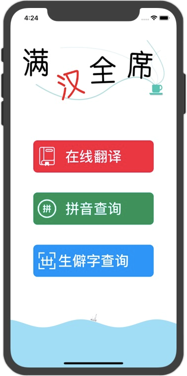
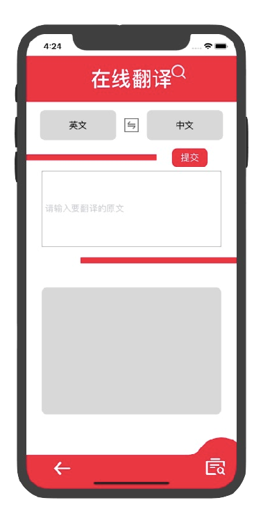
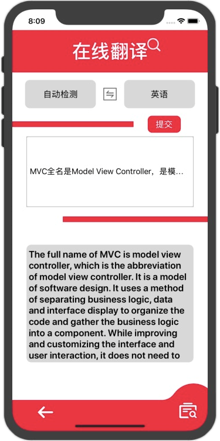
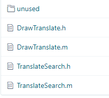

# 中山大学数据科学与计算机学院本科生实验报告

## （2019年秋季学期）

| 课程名称 | 手机平台应用开发 | 任课老师     | 郑贵锋            |
| -------- | ---------------- | ------------ | ----------------- |
| 年级     | 2019级           | 专业（方向） | 软件工程          |
| 学号     | 17343089         | 姓名         | 莫智强            |
| 电话     | 18877409509      | Email        | 2439777344@qq.com |
| 开始日期 | 2019.12.10       | 完成日期     | 2020.01.12        |

------

## 一、实验题目

## 期末项目——满汉全席

------

## 二、实现内容

### 本人负责的应用的实现部分：

- MainPage页面UI的实现
- 在线翻译UI的实现
- 项目架构的搭建
- 整个项目的整合
- 使用在线翻译API完成正确的网络请求获取对应数据
- 小组实验报告的编写、参与PPT的制作

------

## 三、实验结果

### (1)实验截图

| 页面           |                |
| -------------- | -------------- |
|  |  |
|  |  |

### (2)实验步骤以及关键代码

mainpage：

```objective-c
#import <Foundation/Foundation.h>
#import "MainPage.h"
#import "TranslatePage/TranslateSearch.h"
#import "./RarelyUsedWordPage/RarelyUsedWordPageController.h"
#import "./RarelyUsedWordPage/QueryResultPage.h"
#import "./PinYinPage/Layout/PinYinPage.h"
#define UIColorFromHex(s) [UIColor colorWithRed:(((s & 0xFF0000) >> 16))/255.0  green:(((s & 0xFF00) >> 8))/255.0  blue:((s & 0xFF))/255.0  alpha:1.0]

@interface MainPage()

@end

@implementation MainPage

-(void)viewDidLoad{
    [super viewDidLoad];
//    CGFloat height = self.view.bounds.size.height;
    CGFloat width = self.view.bounds.size.width;
    self.view.backgroundColor = [UIColor whiteColor];
    UIFont *textfont = [UIFont boldSystemFontOfSize:35.f];
    
    UIImage *title= [UIImage imageNamed:@"titlepng.png"];
    //UIImage *back = [self createAImageWithColor:[UIColor blackColor] alpha:0.5];
    UIImageView *vtitle= [[UIImageView alloc]initWithImage:title];
    vtitle.frame=CGRectMake(30, 80, width-60, 160);
    [self.view addSubview:vtitle];
    
    _b1 = [[UIButton alloc]initWithFrame:CGRectMake(width/2 - 150, 250 + 80, 300, 80)];
    [_b1 setTitle:@"在线翻译" forState:UIControlStateNormal];
    _b1.layer.cornerRadius = 10.0f;
    _b1.backgroundColor =  [UIColor colorWithRed:216/255.0 green:65/255.0 blue:77/255.0 alpha:1];
//    [_b1 setImage:[UIImage imageNamed:@"fanyi1.png"] forState:UIControlStateNormal];
    [_b1 addTarget:self action:@selector(handle_one) forControlEvents:UIControlEventTouchDown];
    UIImageView *u1 = [[UIImageView alloc]initWithFrame:CGRectMake(width/2 -150 +10, 250+80+16, 48, 48)];
    
    _b2 = [[UIButton alloc]initWithFrame:CGRectMake(width/2 - 150, 380 + 80, 300, 80)];
    [_b2 setTitle:@"拼音查询" forState:UIControlStateNormal];
    _b2.layer.cornerRadius = 10.0f;
    _b2.backgroundColor = [UIColor colorWithRed:0.18 green:0.55 blue:0.36 alpha:1];
//    [_b2 setImage:[UIImage imageNamed:@"pinyin1.png"] forState:UIControlStateNormal];
    [_b2 addTarget:self action:@selector(handle_two) forControlEvents:UIControlEventTouchDown];
    UIImageView *u2 = [[UIImageView alloc]initWithFrame:CGRectMake(width/2 -150 +10, 380+80+16, 48, 48)];
    
    _b3 = [[UIButton alloc]initWithFrame:CGRectMake(width/2 - 150, 510 + 80, 300, 80)];
    [_b3 setTitle:@"生僻字查询" forState:UIControlStateNormal];
    _b3.layer.cornerRadius = 10.0f;
    _b3.backgroundColor = UIColorFromHex(0x439bf2);
//    [_b3 setImage:[UIImage imageNamed:@"shengpi.png"] forState:UIControlStateNormal];
    [_b3 addTarget:self action:@selector(handle_three) forControlEvents:UIControlEventTouchDown];
    UIImageView *u3 = [[UIImageView alloc]initWithFrame:CGRectMake(width/2 -150 +10, 510+80+16, 48, 48)];
    
    _b1.titleLabel.font = _b2.titleLabel.font = _b3.titleLabel.font = textfont;
    _b1.titleLabel.textColor = _b2.titleLabel.textColor = _b3.titleLabel.textColor = [UIColor blackColor];
    u1.image = [UIImage imageNamed:@"fanyi1.png"];
    u2.image = [UIImage imageNamed:@"pinyin1.png"];
    u3.image = [UIImage imageNamed:@"shengpi.png"];
    u1.backgroundColor = u2.backgroundColor = u3.backgroundColor = [UIColor colorWithWhite:1.0 alpha:0.0];
    
    [self.view addSubview:_b1];
    [self.view addSubview:_b2];
    [self.view addSubview:_b3];
    
    [self.view addSubview: u1];
    [self.view addSubview: u2];
    [self.view addSubview: u3];

    ///////////
    WaveView *awave = [WaveView waveViewWithConfig:^(WaveConfig *config) {
        config.position = WavePositionBottom;
        config.bgColor = [UIColor clearColor];
        config.isAnimation = YES;
        config.isShowImage = YES;
        config.waveSpeed = 0.05;
        config.waveA = 10;
        config.waveColor = [UIColor colorWithRed:135.0/255 green:206.0/255 blue:235.0/255 alpha:0.7];
    }];
    _wave = awave;
    _wave.frame = CGRectMake(0, [UIScreen mainScreen].bounds.size.height - 150, [UIScreen mainScreen].bounds.size.width, 150);
    [self.view addSubview:_wave];
}

-(void)viewWillAppear:(BOOL)animated {
    [self.navigationController.navigationBar setHidden:YES];
}

-(void)handle_one{
    TranslateSearch *t = [[TranslateSearch alloc]init];
    [self.navigationController pushViewController:t animated:NO];
}

-(void)handle_two{
    PinYinPage *pinyinpage = [[PinYinPage alloc] init];
    [self.navigationController pushViewController:pinyinpage animated:NO];
}

-(void)handle_three{
    RarelyUsedWordPageController *page=[[RarelyUsedWordPageController alloc]init];
    [self.navigationController pushViewController:page animated:NO];
}

@end
```

在线翻译功能项目文件结构：



MD5：

```objective-c
-(NSString *)stringToMD5:(NSString *)str {
    
    // 1.首先将字符串转换成UTF-8编码, 因为MD5加密是基于C语言的,所以要先把字符串转化成C语言的字符串
    const char *fooData = [str UTF8String];
    // 2.然后创建一个字符串数组,接收MD5的值
    unsigned char result[CC_MD5_DIGEST_LENGTH];
    // 3.计算MD5的值, 这是官方封装好的加密方法:把我们输入的字符串转换成16进制的32位数,然后存储到result中
    CC_MD5(fooData, (CC_LONG)strlen(fooData), result);
    /*
     第一个参数:要加密的字符串
     第二个参数: 获取要加密字符串的长度
     第三个参数: 接收结果的数组
     */
    // 4.创建一个字符串保存加密结果
    NSMutableString *saveResult = [NSMutableString string];
    // 5.从result 数组中获取加密结果并放到 saveResult中
    for (int i = 0; i < CC_MD5_DIGEST_LENGTH; i++) {
        [saveResult appendFormat:@"%02x", result[i]];
    }
    // x表示十六进制，%02X  意思是不足两位将用0补齐，如果多余两位则不影响
    return saveResult;
    /*
     这里返回的是32位的加密字符串，有时我们需要的是16位的加密字符串，其实仔细观察即可发现，16位的加密字符串就是这个字符串中见的部分。我们只需要截取字符串即可（[saveResult substringWithRange:NSMakeRange(7, 16)]）
     */
}
```

请求API：

```objective-c
-(void)handleRequestWithStr{
    NSString *strplus = [_appid stringByAppendingString:[_q stringByAppendingString:[_salt stringByAppendingString:_apppwd]]];
    _sign = [self stringToMD5:strplus];
    //important!
    NSString *change_q = [_q stringByAddingPercentEscapesUsingEncoding:NSUTF8StringEncoding];
    
    NSString *send_str = [NSString stringWithFormat:@"https://api.fanyi.baidu.com/api/trans/vip/translate?q=%@&from=%@&to=%@&appid=%@&salt=%@&sign=%@",change_q,_from,_to,_appid,_salt,_sign];
    
    NSURLSessionConfiguration *defaultConfigObject = [NSURLSessionConfiguration defaultSessionConfiguration];
    NSURLSession *delegateFreeSession = [NSURLSession sessionWithConfiguration: defaultConfigObject
                                                                      delegate: self
                                                                 delegateQueue: [NSOperationQueue mainQueue]];
    
    NSURL *url = [NSURL URLWithString:send_str];
    NSURLRequest *request = [NSURLRequest requestWithURL:url];
    
    NSURLSessionDataTask * dataTask = [delegateFreeSession dataTaskWithRequest:request
                                                             completionHandler:^(NSData *data, NSURLResponse *response, NSError *error) {
         if(error == nil)
         {
             //获得的json先转换成字符串
             NSString *receiveStr = [[NSString alloc]initWithData:data encoding:NSUTF8StringEncoding];
             //字符串再生成NSData
             NSData * d = [receiveStr dataUsingEncoding:NSUTF8StringEncoding];
             //再解析
             NSDictionary *jsonDict = [NSJSONSerialization JSONObjectWithData:d options:NSJSONReadingMutableLeaves error:nil];
             //             NSLog(@"%@",jsonDict[@"trans_result"][0][@"dst"]);
             
             [self->_record addRecord:jsonDict[@"trans_result"][0][@"src"] outcome:jsonDict[@"trans_result"][0][@"dst"]];
             _textView.text = jsonDict[@"trans_result"][0][@"dst"];
         }
     }];
    
    [dataTask resume];
}
```

选择互译语言的下拉列表：

```objective-c
-(void)handle_button_1:(UIButton *)btn{
    btn.selected = !btn.selected;
    if (btn.selected == NO) {
        _tableView1.frame = CGRectMake(self.view.bounds.size.width/2-30-150, 210, 150, 0);
    }
    else {
        _tableView1.frame = CGRectMake(self.view.bounds.size.width/2-30-150, 210, 150, 240);
    }
}

-(void)handle_button_2:(UIButton *)btn{
    btn.selected = !btn.selected;
    if (btn.selected == NO) {
        _tableView2.frame = CGRectMake(self.view.bounds.size.width/2 + 30, 210, 150, 0);
    }
    else {
        _tableView2.frame = CGRectMake(self.view.bounds.size.width/2 + 30, 210, 150, 240);
    }
}

- (CGFloat)tableView:(UITableView *)tableView heightForRowAtIndexPath:(NSIndexPath *)indexPath
{
    return 40.0f;
}

- (NSInteger)numberOfSectionsInTableView:(UITableView *)tableView
{
    return [_dataArray count];
}

- (NSInteger)tableView:(UITableView *)tableView numberOfRowsInSection:(NSInteger)section
{
    return 1;
}

- (void)tableView:(UITableView *)tableView didSelectRowAtIndexPath:(NSIndexPath *)indexPath
{
    if (tableView == _tabelView_data1){
        [_button1 setTitle:_dataArray[indexPath.section] forState:UIControlStateNormal];
        _tableView1.frame = CGRectMake(20, 360, 200, 0);
        _button1.selected = !_button1.selected;
        _button_num1 = indexPath.section;
    }
    if (tableView == _tabelView_data2){
        [_button2 setTitle:_dataArray[indexPath.section] forState:UIControlStateNormal];
        _tableView2.frame = CGRectMake(160, 360, 200, 0);
        _button2.selected = !_button2.selected;
        _button_num2 = indexPath.section;
    }
}

- (UITableViewCell *)tableView:(UITableView *)tableView cellForRowAtIndexPath:(NSIndexPath *)indexPath
{
    UITableViewCell * cell = [tableView dequeueReusableCellWithIdentifier:@"ID"];
    if (cell == nil) {
        cell = [[UITableViewCell alloc] initWithStyle:UITableViewCellStyleDefault reuseIdentifier:@"ID"];
    }
    [cell.imageView setImage:[UIImage imageNamed:_flagsArray[indexPath.section]]];
    cell.backgroundColor = [UIColor colorWithRed:124/255.0 green:125/255.0 blue:127/255.0 alpha:0.2];
    cell.textLabel.font = [UIFont systemFontOfSize:15];
    cell.textLabel.text = _dataArray[indexPath.section];
    cell.selectionStyle = UITableViewCellSelectionStyleNone;
    return cell;
}
```

### (3)实验遇到的困难以及解决思路

作为组长，最大的困难还是如何正确合理分配组员的任务，然后达到高效的目的。然而现实中由于项目开发经验的缺失，导致每个人的协调分工做得不够好，做了一些无用功。

## 四、课后实验结果

每个人完成了对应任务，并且对项目开发了解得更多。

## 五、实验思考及感想

这次的实验因为选题自由，因此似乎我们组的功能还是比较简单的，但是我觉得考察的不但是对课上学过的知识的应用，更重要的是对小组合作的考验，第一次合作完成一个可运行的APP，其实对我们组每个人可能都是第一次。因此最大的值得学习的地方还是这次实验能够让大家都清楚整个项目的开发流程，开发过程中要注意些什么。

其次小组合作的好处就是能相互学习，以前的作业都是自己独立完成，小组作业则让我看到了其他组员是十分优秀的，因此有很多值得学习借鉴的地方。今后还要不努力的呀。

这是这门课最后一次实验了，这个学期学到的东西，其实蛮多的，最重要的是培养了对IOS开发这个方向的兴趣。希望自己还能保持兴趣并且不断努力进步。