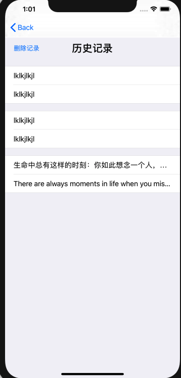

# 中山大学数据科学与计算机学院本科生实验报告
## （2019年秋季学期）
| 课程名称 | 手机平台应用开发 | 任课老师 | 郑贵锋 |
| :------------: | :-------------: | :------------: | :-------------: |
| 年级 | 2019级 | 专业（方向） | 软件工程 |
| 学号 | 17343097 | 姓名 | 区梓俊 |
| 电话 | xxx | Email | 953024504@qq.com |
| 开始日期 | 2019.12 | 完成日期 | 2020.01

---

## 一、实验题目
## 期末项目——xxx

---

## 二、实现内容
### 本人负责的应用的实现部分：
    1.历史界面，用列表显示查询记录
    2.将存储记录存储到缓存中
    3.记录的存储添加、删除接口

---

## 三、实验结果
### (1)实验截图

历史记录页面



### (2)实验步骤以及关键代码

记录的存储添加、删除接口

记录项的处理通过一个类实现，大概想法是操作页面初始化时，创建一个用于记录处理的对象，记录的各种操作都先要读取记录的数量，记录的数目读取通过查找是否有文件名为缓存文件前缀，加上缓存编号的文件实现，编号从0开始，直到没有的编号就是记录的数目。

1. 首先是记录存储。记录的存储利用缓存实现，先是设置好记录的前缀，然后获得沙盒中cache的路径，然后设置好每个cache的文件名字，名字需要根据当前记录的数目来进行设置。设置好将记录写入到缓存文件中，在写入缓存文件时需要将数据的格式设置为UTF-8，另外还要将记录对象的数量增加。

   ```
   		NSString *str2 = [_input_prefix stringByAppendingString:str];
       NSFileManager *fm =  [NSFileManager defaultManager];
       NSString *cache = NSSearchPathForDirectoriesInDomains(NSCachesDirectory, NSUserDomainMask, YES).firstObject;
       
       NSString *path = [[NSString alloc] initWithFormat:@"%@/t%ld%ld", cache, _recordType, _num];
       
       _num ++;
       NSData *data = [str1 dataUsingEncoding:NSUTF8StringEncoding];
       NSLog(@"add %@", str1);
       [data writeToFile:path atomically:YES];
   ```

2. 记录的读取。记录的读取根据对象中记录的数目进行读取，通过缓存文件的前缀以及编号得到每个记录，这里读取的时候需要使用UTF-8进行解码。

   ```
   -(NSMutableArray *)getRecord {
       NSLog(@"num: %ld", _num);
       NSMutableArray *arr = [[NSMutableArray alloc] init];
       NSFileManager *fm =  [NSFileManager defaultManager];
       NSString *cache = NSSearchPathForDirectoriesInDomains(NSCachesDirectory, NSUserDomainMask, YES).firstObject;
       for (long i = _num - 1; i >= 0; i -- ) {
           NSString *path = [[NSString alloc] initWithFormat:@"%@/t%ld%ld", cache, _recordType, i];
           if ([fm fileExistsAtPath:path]) {
               NSData *data;
               data = [NSData dataWithContentsOfFile:path];
               [arr addObject:[[NSString alloc] initWithData:data encoding:NSUTF8StringEncoding]];
           } else {
               break;
           }
       }
       return arr;
   }
   ```

3. 记录的删除。记录的删除与读取类似，根据记录的数量获取记录的名字，然后将对应的缓存文件删除。

   ```
   -(void)delRecord {
       for (int i = 0; i < _num; i ++ ) {
           NSFileManager *fm =  [NSFileManager defaultManager];
           NSString *cache = NSSearchPathForDirectoriesInDomains(NSCachesDirectory, NSUserDomainMask, YES).firstObject;
           NSString *path = [[NSString alloc] initWithFormat:@"%@/t%ld%d", cache, _recordType, i];
           [fm removeItemAtPath:path error:nil];
       }
       _num = 0;
   }
   ```

记录页面

记录页面存放了用户输入以及结果，通过tableview 实现，一个section记录一对原文以及结果，开始为记录的缩写，点击后显示整条记录，另外还有一个删除记录的按钮。

1. 记录加载。记录页面在初始化前需要创建一个用于记录操作的对象，然后调用对象中的`getRecord`来获得对应的记录，并将其存放在数组中，另外根据记录数量设置section数量。

   ```
   - (void)loadRecord {
       _record = [_loader getRecord];
       _sectionNum = [_loader getNum] / 2;
       _open = [[NSMutableArray alloc] init];
       for (int i = 0; i < _sectionNum; i ++ ) {
           NSMutableArray *tem = [[NSMutableArray alloc] init];
           for (int j = 0; j < 2; j ++ ) {
               [tem addObject:[NSNumber numberWithInteger:1]];
           }
           [_open addObject:tem];
       }
       NSLog(@"row num: %ld", _rowNum);
   }
   ```

2. tableview cell实现。首先是cell的复用、初始化代码，然后是使用上面的数组初始化每一个cell的文本，同时因为复用的关系，需要另外设置一个数组记录每个section的展开情况，用于后面的点击展开响应的实现。

   ```
   -(UITableViewCell *)tableView:(UITableView *)tableView cellForRowAtIndexPath:(NSIndexPath *)indexPath{
       static NSString *cellID = @"cellID";
       UITableViewCell *cell = [tableView dequeueReusableCellWithIdentifier:cellID];
       if (cell == nil) {
           cell = [[UITableViewCell alloc]initWithStyle:UITableViewCellStyleDefault reuseIdentifier:cellID];
       }
       NSString *str = [[NSString alloc] initWithFormat:(@"%@"), _record[indexPath.row + indexPath.section * 2]];
       cell.textLabel.text = str;
       NSNumber * num = _open[indexPath.section][indexPath.row];
       cell.textLabel.numberOfLines = [num integerValue];
       [cell sizeToFit];
       return cell;
   }
   ```

3. 点击展开响应。初始状态下，将cell的textLabel的numberOfLine设置为1，表示只显示一行的数据，然后通过点击将对应记录设置为展开状态，通过调用reloadRowsAtIndexPath实现更新从而将对应点击的section展开。

   ```
   -(void)tableView:(UITableView *)tableView didSelectRowAtIndexPath:(NSIndexPath *)indexPath{
       //取消选择
       [tableView deselectRowAtIndexPath:indexPath animated:YES];
       NSNumber * num = _open[indexPath.section][indexPath.row];
       NSLog(@"%ld", indexPath.row + indexPath.section * 2);
       _open[indexPath.section][indexPath.row] = [num integerValue] == 0 ? [NSNumber numberWithInteger:1] : [NSNumber numberWithInteger:0];
       [tableView reloadRowsAtIndexPaths:@[indexPath] withRowAnimation:UITableViewRowAnimationFade];
   }
   ```

   

### (3)实验遇到的困难以及解决思路

1. tableviewcell的复用问题，因为cell的复用导致不能直接修改numberOfline，否则在拖动过程中会改变已经展开的section，或点击后展开的是其他的section。后面通过用一个数组记录展开状态来实现，每一次复用都将对应的numberOfLine赋值给对应的section。
2. 进行添加记录后，页面不能及时更新，这里因为页面在tabbar中已经初始化好了，在切换后页面还保持着之前的状态，所以页面不会更新，这里通过在viewdid appear来更新页面。

---

## 四、课后实验结果

实现了记录的增添、删除接口，以及记录显示页面。

---

## 五、实验思考及感想

1. 遇到不会需要多去查阅手册。
2. 要看清楚每个组件的使用方法并需要灵活运用。
3. 语言基础语法还是很重要的，很容易因为语法而不知道怎么写。
4. 小组合作十分的重要，我们要锻炼自己的小组合作、配合能力。

---

