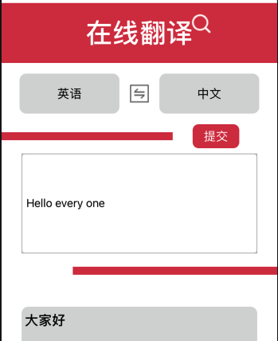
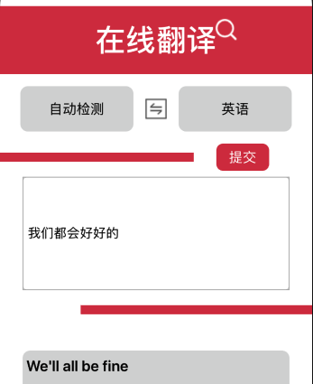
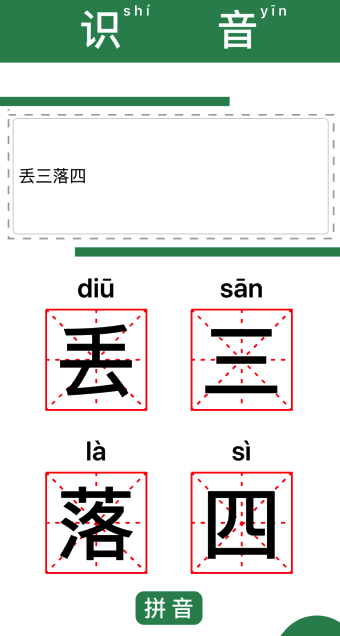
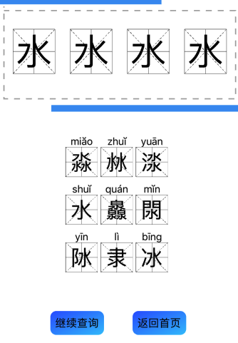
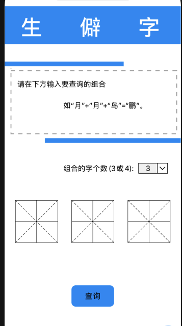
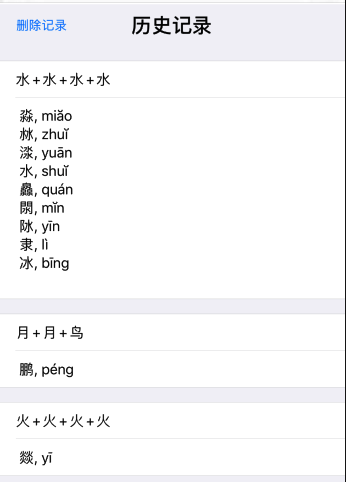
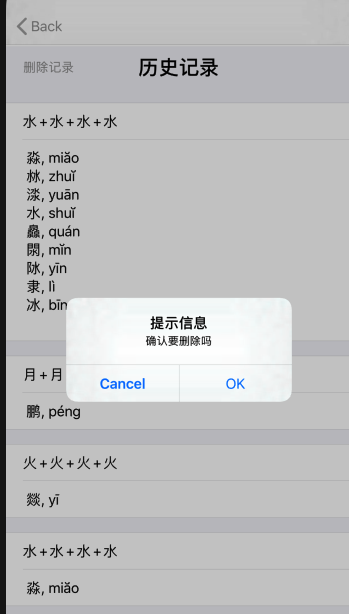

### 1.引言

如今在开放、经济全球化的时代中，只懂一门语言已经是不够的了，我们需要与他人交流，因此语言的学习变得越来越重要，而选择一门好的学习语言的工具可以大大加快自己学习语言的进度。

### 2. 软件概述

#### 2.1目标

多功能的语言学习工具

#### 2.2功能

* 翻译
* 多音字识别
* 生僻字识别

#### 2.3 性能
  a.数据精确度【包括输入、输出及处理数据的精度】
  b.时间特性【如响应时间、处理时间、数据传输时间等。】
  c.灵活性【在操作方式、运行环境需做某些变更时软件的适应能力。】

### 3. 运行环境

ios手机、平板端

### 4. 使用说明

#### 4.1安装和初始化

直接安装

#### 4.2输入、输出

**翻译**

* 输入

  翻译内容（中文、英文、韩语、日语等）

* 输出

  对应的翻译结果

**多音字识别**

* 输入

  单音、多音字

* 输出

  根据成语意思给出对应的音节

**生僻字识别**

* 输入

  生僻字的组合

* 输出

  对应的生僻字以及拼音

  

#### 4.2.1数据背景

  使用百度API获取数据。

#### 4.2.2数据格式

**翻译**

​	长度无限制，可以输入多种不同的语言。

**多音字查询**

​	输入1～4个字，多音字根据成语意思给出对应的音节。

**生僻字查询**

​	输入3～4个字，根据输入文字的组合推断出对应的生僻字。

4.2.3举例

**翻译**

英文->中文

* 输入

  ```
  hello every one
  ```

* 输出

  ```
  大家好
  ```

  

自动检测->英文

* 输入

  ```
  我们都会好好的
  ```

* 输出

  ```
  We'll all be fine
  ```

  

**多音字识别**

* 输入

  ```
  丢三落四
  ```

* 输出

  ```
  diu san la si
  ```

  

**生僻字查询**

单字推断

* 输入

  ```
  月、月、鸟
  ```

* 输出

  ```
  鹏水
  ```

  \

多字推断

* 输入

  ```
  水、水、水、水
  ```

* 输出

  

### 5. 运行说明

#### 5.1运行表

* 翻译
* 查询多音字
* 查询生僻字
* 查询、删除历史记录

#### 5.2运行步骤

**翻译**

1. 选择好要翻译的输入语言以及目标输出语言
2. 在中间输入框输入要翻译的内容

3. 单击提交按钮或按回车键

4. 在下面的灰色框查看翻译结果


**查询多音字**

1. 在输入框输入1～4个的字、词或成语

2. 点击下方的拼音按钮

3. 在下方的方框中查看查找结果

   

**生僻字查询**

1. 将不认识的生僻字拆成自己认识的文字
2. 选择组合的字的个数（3或4）
3. 输入生僻字的偏旁部首组合
4. 点击下方查询按钮提交内容
5. 在弹出的页面中查看查询的生僻字



**查询、删除历史记录**

查询记录

1. 在每个页面的右下角都有一个按钮，点击进入历史记录页面

2. 每一项都有对应着查询的内容以及记录，初始为省略单行显示
3. 点击对应的记录展开显示记录的所有内容



删除记录

1. 在历史记录页面的左上角有一个删除记录的按钮，点击后提示是否要删除
2. 点击确认后历史记录缓存就会删除

