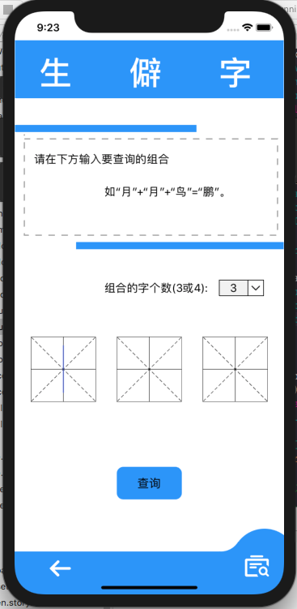
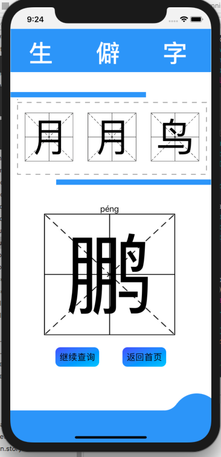
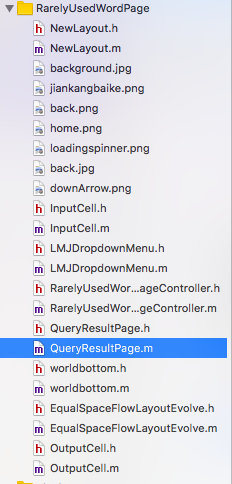

# 中山大学数据科学与计算机学院本科生实验报告
## （2019年秋季学期）
| 课程名称 | 手机平台应用开发 | 任课老师 | 郑贵锋 |
| :------------: | :-------------: | :------------: | :-------------: |
| 年级 | 2019级 | 专业（方向） | 软件工程计应方向 |
| 学号 | 17343133 | 姓名 | 许泰琪 |
| 电话 | 13246804721 | Email | 869307087@qq.com |
| 开始日期 | 2019.12 | 完成日期 | 2020.01

---

## 一、实验题目
## 期末项目——xxx

---“满汉全席”应用开发

## 二、实现内容
### 本人负责的应用的实现部分：
    1.RarelyUsedWordPage控件布局
    2.RarelyUsedWordPage田字格背景输入框
    3.RarelyUsedWordPage田字格背景输入框限制输入字数
    4.RarelyUsedWordPage字数选择下拉列表动画
    5.RarelyUsedWordPage查询功能跳转至查询结果页面
    6.查询结果页面布局控制
    7.查询结果页面田字格展示参数列表
    8.查询结果页面查询结果展示弹出动画
    9.查询结果页面跳转至主页和查询页面
    10.产品需求分析与设计说明文档编写
    11.部署文档编写

---

## 三、实验结果
### (1)实验截图

  
### (2)实验步骤以及关键代码

1.空间布局采用懒加载的方式，将一些不变的控件添加至View
	
	-(UILabel *)lazytitlelabel1{
    //导航栏
    	if(_titlelabel1==nil){
        	_titlelabel1= [[UILabel alloc]init];
        	//add fanhui icon
        	UIImage *back= [UIImage imageNamed:@"fanhui.png"];
        	//UIImage *back = [self createAImageWithColor:[UIColor blackColor] alpha:0.5];
       
      	 	UIImageView *backView= [[UIImageView alloc]initWithImage:back];
       
      		backView.frame=CGRectMake(((self.view.frame.size.width / 3) - 35) / 2, self.view.frame.size.height - 85 + 25, 40, 40);
        
        	UITapGestureRecognizer *tap = [[UITapGestureRecognizer alloc]initWithTarget:self action:@selector(back)];
        	[backView addGestureRecognizer:tap];
        	backView.userInteractionEnabled = YES;
        	[self.view addSubview:backView];
        
        //add history
        	UIImage *log= [UIImage imageNamed:@"history.png"];
        	//UIImage *back = [self createAImageWithColor:[UIColor blackColor] alpha:0.5];
        	UIImageView *logView= [[UIImageView alloc]initWithImage:log];
        	logView.frame=CGRectMake(self.view.frame.size.width - 100 + 38, self.view.frame.size.height - 85 + 22, 40, 40);
        
        	UITapGestureRecognizer *tap2 = [[UITapGestureRecognizer alloc]initWithTarget:self action:@selector(log)];
        	[logView addGestureRecognizer:tap2];
        	logView.userInteractionEnabled = YES;
       	 [self.view addSubview:logView];
        
    	}
   		 return _titlelabel1;
	}
	
2.田字格背景输入框采取了自定义CollectionCell的方式
	
	@interface InputCell : UICollectionViewCell
	@property (strong,nonatomic) UITextField *content;
	@property (nonatomic,strong) UIImageView *image;
	@end

3.田字格输入限制实现如下：
	
	#pragma mark - Notification Method
	-(void)textFieldEditChanged:(NSNotification *)obj
	{
   		UITextField *textField = (UITextField *)obj.object;
   		NSString *toBeString = textField.text;
   	 	NSString *lang = [textField.textInputMode primaryLanguage];
   		if ([lang isEqualToString:@"zh-Hans"])// 简体中文输入
    	{
       		 //获取高亮部分
        	UITextRange *selectedRange = [textField markedTextRange];
        	UITextPosition *position = [textField positionFromPosition:selectedRange.start offset:0];
        
       	 	// 没有高亮选择的字，则对已输入的文字进行字数统计和限制
       	 	if (!position)
       	 	{
        	  	  if (toBeString.length > 1)
        	    {
        	        textField.text = [toBeString substringToIndex:1];
        	    }
        	}
        
    	}
   		 // 中文输入法以外的直接对其统计限制即可，不考虑其他语种情况
    	else
    	{
     	   if (toBeString.length > 0)
     	   {
     	       NSRange rangeIndex = [toBeString rangeOfComposedCharacterSequenceAtIndex:0];
     	       if (rangeIndex.length == 0)
     	       {
     	           textField.text = [toBeString substringToIndex:0];
     	       }
    	        else
     	       {
     	           NSRange rangeRange = [toBeString rangeOfComposedCharacterSequencesForRange:NSMakeRange(0, 0)];
             	   textField.text = [toBeString substringWithRange:rangeRange];
           		}
        	}
   		 }
	}
	

4.字数选择下拉列表动画实现

	-(void)drop {
    	if(self.isDroped==NO){
  	  [UIView animateKeyframesWithDuration:0.5 delay:0 options:UIViewKeyframeAnimationOptionCalculationModeLinear animations:^{
       [UIView addKeyframeWithRelativeStartTime:0 relativeDuration:0.6 animations: ^{
            CGFloat width=self.view.frame.size.width;
            self.option2.frame = CGRectMake(width-100,400+12.5,45 ,25);
        }];
        [UIView addKeyframeWithRelativeStartTime:0.6 relativeDuration:0.4 animations: ^{
            // key frame 1
            CGFloat width=self.view.frame.size.width;
            self.option2.frame =CGRectMake(width-100,400+12.5+24,45 ,25);
        }];
    } completion:^(BOOL finished) {
    }];
        self.isDroped=YES;
    }else{
        [UIView animateKeyframesWithDuration:0.5 delay:0 options:UIViewKeyframeAnimationOptionCalculationModeLinear animations:^{
            [UIView addKeyframeWithRelativeStartTime:0 relativeDuration:0.6 animations: ^{
                CGFloat width=self.view.frame.size.width;
                self.option2.frame = CGRectMake(width-100,400+12.5+24,45 ,25);
            }];
            [UIView addKeyframeWithRelativeStartTime:0.6 relativeDuration:0.4 animations: ^{
                // key frame 1
                CGFloat width=self.view.frame.size.width;
                self.option2.frame =CGRectMake(width-100,400+12.5,45 ,25);
            }];
        } completion:^(BOOL finished) {
        }];
        self.isDroped=NO;
    }
}

5.查询功能跳转至结果页面

按钮采用渐变色

	UIButton *query= [[UIButton alloc]initWithFrame:CGRectMake((width-100)/2, 700, 100, 50)];
    CAGradientLayer *grad = [CAGradientLayer layer];
    grad.colors = @[(__bridge id) UIColorFromHex(0x439bf2).CGColor,(__bridge id)UIColorFromHex(0x439bf2).CGColor];
    //设置渐变的方向
    //(0,0)->(1,0)从左往右
    //(0,0)->(0,0)从上往下
    grad.startPoint = CGPointMake(0, 0);
    grad.endPoint = CGPointMake(1, 1);
    grad.cornerRadius=10;
    //设置渐变的起始位置 (从哪个点开始渐变到下一个颜色)
    // 设置不透明
    grad.frame=query.bounds;
    [query.layer addSublayer:grad];
    [query setTitle:@"查询" forState:UIControlStateNormal];
    [query setTitleColor:[UIColor blackColor] forState:UIControlStateNormal];
    [query addTarget:self action:@selector(queryResult) forControlEvents:UIControlEventTouchDown];
    [self.view addSubview:query];

quertResult事件函数

获取输入的参数列表，然后进行异步网络访问
	 
	 //调用api
             NSString *compose=[[NSString alloc]initWithFormat:@"%@+%@+%@", str1, str2,str3];
            self.query=compose;
            
            ShowAPIRequest *request=[[ShowAPIRequest alloc] initWithAppid:@"129513" andSign:@"633616f17cd741baaf7118063596f163" ];
            [request post:@"https://route.showapi.com/905-1"//注意您需要先订购该接口套餐才能测试
                  timeout:20000//超时设置为20秒
                   params:[[NSDictionary alloc] initWithObjectsAndKeys:compose,@"parts", nil]//传入参数
           withCompletion:^(NSDictionary *result) {
               //打印返回结果
                           }
        
然后实例化查询结果页面，传递参数并进行跳转

	 NSArray *queryArray= [[NSArray alloc]initWithObjects:str1,str2,str3, nil];
     Record *record= [[Record alloc]initWithType:1];
     [record addRecord:self.query outcome:self.result];
     QueryResultPage *page= [[QueryResultPage alloc]initWithNumber:self.number dictionary:self.content2 queryArray:queryArray history:self.p];
     [self.navigationController pushViewController:page animated:YES];
               
   
6.查询结果页面布局，同样采用懒加载方式
7.查询结果页面田字格展示参数列表，简单UILabel布局
8.查询结果页面查询结果展示弹出动画，CollectionCell动画
	
	-(void)animateCollection{
   		NSArray *cells = _collectionView.visibleCells;
    	CGFloat collectionHeight = _collectionView.bounds.size.height;
    	for (UICollectionViewCell *cell in cells.objectEnumerator) {
       	 	cell.alpha = 1.0f;
        	cell.transform = CGAffineTransformMakeTranslation(0, collectionHeight);
        	NSUInteger index = [cells indexOfObject:cell];
        	[UIView animateWithDuration:0.7f delay:0.5*index usingSpringWithDamping:0.8 initialSpringVelocity:0 options:0 animations:^{
           	cell.transform =  CGAffineTransformMakeTranslation(0, 0);
        	} completion:nil];
    	}
	}

	
9.查询结果页面跳转至主页和查询页面，简单的UIButton布局

### (3)实验遇到的困难以及解决思路
  
  由于一开始，小组协商不够完善，导致是三个功能的实现UI界面不同意，最后，我们小组内成员线下开会商议进行页面统一，最终完成了UI设计。
  
  
---

## 四、课后实验结果

最终完整的完成了整个app的开发。
  
---

## 五、实验思考及感想

本次实验主要是，对这一学期学习的知识的掌握程度的考察，增加对知识的使用理解，所以尽可能的应用了所学的知识。由于没有太过陌生的知识，所以总体实现上，实现难度并不大，但是现对来说任务比较繁重，所以也需要花费不少的精力。

这次实验也算是对本学期课程的回顾，在本学期的学习中，深刻的了解了iOS系统应用的开发，学习了当前大部分应用的开发技巧，学习到了各种控件的使用，对框架的学习也有了不错的了解，总而言之，收获无疑是巨大的。感谢老师和TA的辛勤教导。

---

