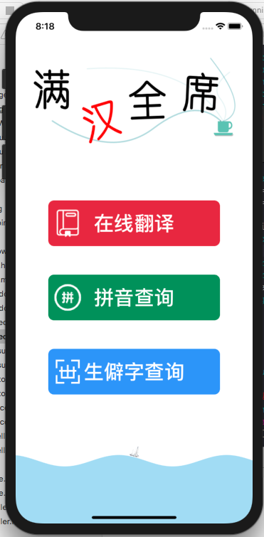
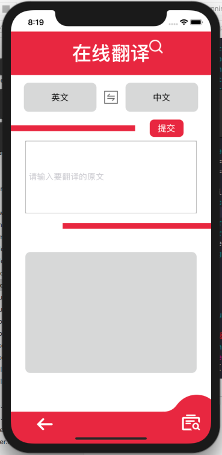
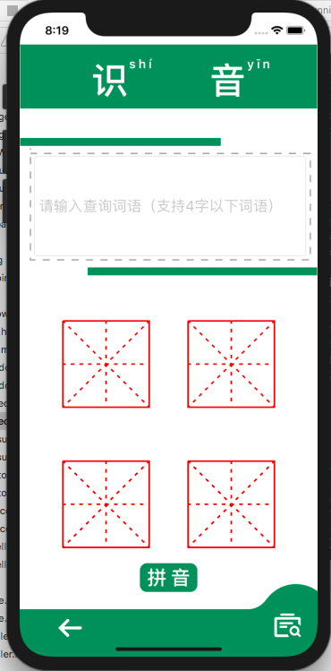
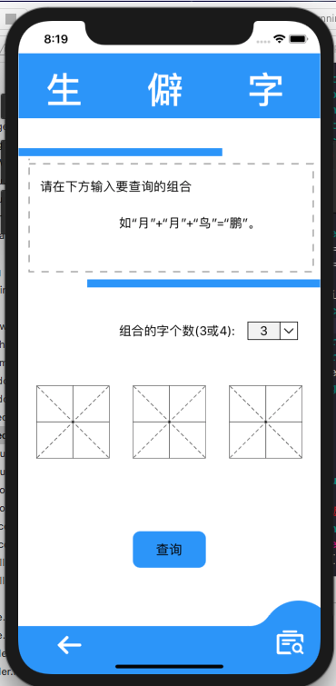

# 期末大项目-“满汉全席”app需求分析与设计文档 
## （2019年秋季学期）
---

## 一、实验题目

 期末项目——“满汉全席”

---

## 二、需求分析
    
在如今信息社会的快速发展下，英语的重要性越来越深入人心，所以市面上的各种英语学习软件和英语翻译软件，但是作为我们自己的汉语学习软件却非常稀少。

而且由于智能手机的大量应用和电脑的大量使用，人们对汉字的重视程度越来越低，所以提笔忘字的现象越来越频繁，对一些字的音的了解也近停留在了只是大概有印象的程度，更有好多字明明是多音字，却只知道其中一个音，导致生活中的交流中出现大量的不标准发音。尤其时方言口音较重的地区，学习和使用标准的普通话都有很大的困难。为此，我们的app提供了汉字的拼音查询功能，拼音查询功能提供了为输入的汉字查找其拼音的功能，查询单字时，会显示其所有的发音，并按照其拼音的使用频率的次序将其列出。依次来让使用者尽可能的了解并学习汉字的发音，并借此纠正使用者在生活中使用。

除此之外，生活中，信息交流越来越频繁，人们在网上发表一些评论时，难免会碰到使用一些不认识的生僻字来增加自己言论的趣味程度，但是大多数人们尤其是年轻人们，总是优先使用拼音输入法，而那些不认识的字，不想切换手写输入法的话那就显得有写无能为力了，而且就算切换成手写输入法的话，一些生僻字大多数都笔画多且结构复杂，不习惯手写输入的话自然输入起来有极大的困难。为此，我们的app提供生僻字查询功能，大多数生僻字都是有一些我们认识的字或其中的某一部分组成，所以，我们的生僻字查询功能仅需要输入生僻字的每个组合部分，便可以查询出组合出的字的可能的生僻字，此外还会显示出该生僻字的发音供使用者学习。

最后为了增加我们产品的普适性，我们的app同样有语言学习软件共有的翻译功能，而且该翻译功能不仅仅能够把汉语翻译成英语，而是能够把任意的一种语言翻译成汉语或者其他语言，这样如果有对汉语不够了解但是对其他语言比较熟悉的国际友人来说，就会增加很大的实用性。同时也可以进行一些其他语言的了解和学习。

---
## 三、产品设计说明

我们的产品作为一个学习软件，但为了增加使用者的学习兴趣，为我们的界面增加了许多的美术元素。
打开app时，第一个进入的是功能选择界面。

页面上方为我们app的Logo标题，采用了艺术字的形式，来增加产品的美观度。之下的主要界面为三个按钮，分别对应着三个功能，三个按钮的颜色为分别对应着红绿蓝三种颜色，红绿蓝三色为三原色，代表着起源，三原色混合可以得到我们这个缤纷多彩的世界，对应到我们的app中，三种功能的灵活组合使用，便可以方便的学习掌握汉语这门博大精深的语言。

点击第一个按钮，进入的是翻译界面。

翻译界面选取了和按钮相对应的色调，为红色。这样颜色的选取，和大家熟知的有道词典的色调相差不远，可以使用户更加快速的上手使用该功能。此外该页面最上面为语言的选择，中间为要进行翻译的内容，下面为翻译结果的展示结果，由上而下的布局，体现了该功能的使用方法，不需要太多的额外说明便可以让用户明白该功能如何使用。

返回主页后，点击第二个按钮进入的为拼音查询界面。

同样，拼音界面的主色调和第二个按钮的颜色是一致的。采用的绿色，是因为，大家小时候学习汉字时，所使用的汉字本，为了保护我们的视力，经常选取绿色作为配色，所以，我们也做出了同样的选择，此外，在查找拼音时，难免会回想起小时学习的日子，采用绿色，也回应了我们那份怀旧的情怀。查询结果的展示，采用的每个字的背景为一个田字格，这使我们app增加了很多笔墨气息，能够提高使用者对汉字的学习兴趣。而总体的布局，整体来看，会给使用者一种真的在田字格本子上学习写字的感觉，这样会很深刻增加使用者学习的印象。

返回主页后，点击第三个按钮进入生僻字查询界面

生僻字界面，在使用时需要对使用者做一些说明，所以进入界面的上半部分为输入规则的说明，下半部分为参数的输入。参数输入部分同样采取了田字格为背景，为了增加文艺气息。而且较大参数输入字体，强调了每个参数都会对查询结果产生巨大的影响，因此，使用者在使用该功能的时候，潜意识中会稍微仔细斟酌每个参数的选择。在查询结果界面，因为，生僻字的查询，有一点趣味知识的味道，所以采用了动画的方式进行展示，这样可以使用户不感到枯燥，从而更加乐意进行汉字的学习。
