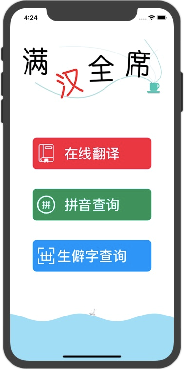
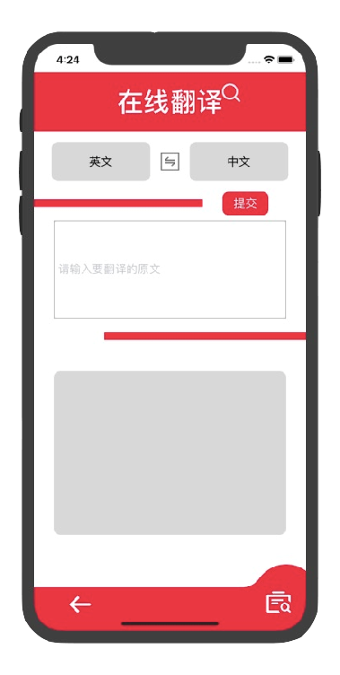
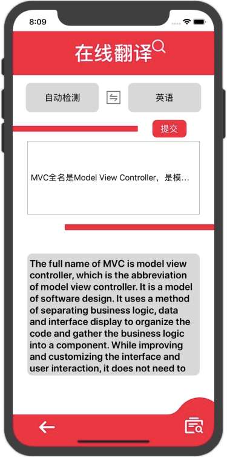

### IOS期末第18组实验报告

## 小组成员

| 姓名   | 学号     |
| ------ | -------- |
| 莫智强 | 17343089 |
| 许泰琪 | 17343133 |
| 李禹虬 | 16340126 |
| 马欢   | 16340165 |
| 区梓俊 | 17343097 |

## LOGO


## 应用名

满汉全席

#### 应用简介

汉语学习者的福音，简单的功能APP具有在线翻译、拼音查询和生僻字查询功能，方便日常生活中打开随时随地使用

- 中文写作好帮手
- 暴打生僻Boss
- 告别哑巴汉语

## 程序运行界面截图

| 描述                                                         | 截图            |
| ------------------------------------------------------------ | --------------- |
| APP首页                                                      |   |
| 在线翻译首页，顶部是title，下面是选择源语言和翻译语言。然后是输入框和输出框 |   |
| 选择时点击会形成下拉列表，每个选项包括国旗和国家名字         |   |
| 源语言支持自动检测，翻译一段长文本后的效果如右图             |   |
| 点击右下角的历史记录图标，记录了以往搜索的全部信息，点开每一个list还会展开 |   |
| 拼音识别主页面                                               |   |
| 通过手写输入汉字即可返回汉字的拼音（多音字返回多个拼音），同时也是支持历史记录功能 |   |
| 生僻字查询主页面                                             |   |
| 成功查询生僻字示例                                           |   |
| 错误查询                                                     |  |
| 错误查询                                                     |  |
| 如果没有找到对应的生僻字会返回多种可能的近似结果             |  |

## 时序图/应用类图

项目结构：


## 所采用的技术

##### 基本UI组件、CollectionView、TableView等

使用原因：很多地方需要用到下拉列表或者普通的选择列表，比如翻译的源语言和目标语言选择，生僻字参数的选择等等

##### 网络请求

APP三个功能都是通过三个不同的API完成的，因此网络请求是必需的。

这里以在线翻译举例：

```objective-c
NSString *send_str = [NSString stringWithFormat:@"https://api.fanyi.baidu.com/api/trans/vip/translate?q=%@&from=%@&to=%@&appid=%@&salt=%@&sign=%@",change_q,_from,_to,_appid,_salt,_sign];
    
NSURLSessionConfiguration *defaultConfigObject = [NSURLSessionConfiguration defaultSessionConfiguration];
    
NSURLSession *delegateFreeSession = [NSURLSession sessionWithConfiguration: defaultConfigObject
                                                                      delegate: self
                                                                 delegateQueue: [NSOperationQueue mainQueue]];
    
NSURL *url = [NSURL URLWithString:send_str];
NSURLRequest *request = [NSURLRequest requestWithURL:url];
```

##### MD5信息摘要算法

在线翻译功能中，因为参数都是直接暴露在请求的URL中，如果不对密码进行隐藏就会暴露自己的信息。

计算一个字符串的MD5值：

```objective-c
-(NSString *)stringToMD5:(NSString *)str {
    
    // 1.首先将字符串转换成UTF-8编码, 因为MD5加密是基于C语言的,所以要先把字符串转化成C语言的字符串
    const char *fooData = [str UTF8String];
    // 2.然后创建一个字符串数组,接收MD5的值
    unsigned char result[CC_MD5_DIGEST_LENGTH];
    // 3.计算MD5的值, 这是官方封装好的加密方法:把我们输入的字符串转换成16进制的32位数,然后存储到result中
    CC_MD5(fooData, (CC_LONG)strlen(fooData), result);
    /*
     第一个参数:要加密的字符串
     第二个参数: 获取要加密字符串的长度
     第三个参数: 接收结果的数组
     */
    // 4.创建一个字符串保存加密结果
    NSMutableString *saveResult = [NSMutableString string];
    // 5.从result 数组中获取加密结果并放到 saveResult中
    for (int i = 0; i < CC_MD5_DIGEST_LENGTH; i++) {
        [saveResult appendFormat:@"%02x", result[i]];
    }
    // x表示十六进制，%02X  意思是不足两位将用0补齐，如果多余两位则不影响
    return saveResult;
    /*
     这里返回的是32位的加密字符串，有时我们需要的是16位的加密字符串，其实仔细观察即可发现，16位的加密字符串就是这个字符串中见的部分。我们只需要截取字符串即可（[saveResult substringWithRange:NSMakeRange(7, 16)]）
     */
}
```

##### UIView动画

比如，主页面底部小船游动动画效果：

```objective-c
WaveView *awave = [WaveView waveViewWithConfig:^(WaveConfig *config) {
        config.position = WavePositionBottom;
        config.bgColor = [UIColor clearColor];
        config.isAnimation = YES;
        config.isShowImage = YES;
        config.waveSpeed = 0.05;
        config.waveA = 10;
        config.waveColor = [UIColor colorWithRed:135.0/255 green:206.0/255 blue:235.0/255 alpha:0.7];
    }];
    _wave = awave;
    _wave.frame = CGRectMake(0, [UIScreen mainScreen].bounds.size.height - 150, [UIScreen mainScreen].bounds.size.width, 150);
    [self.view addSubview:_wave];
```

##### 本地读写

写操作：

```objective-c
-(void)addRecord:(NSString *)str outcome:(NSString *)output{
    
    NSString *str2 = [_input_prefix stringByAppendingString:str];
    NSString *str1 = [_output_prefix stringByAppendingString:output];
    NSFileManager *fm =  [NSFileManager defaultManager];
    NSString *cache = NSSearchPathForDirectoriesInDomains(NSCachesDirectory, NSUserDomainMask, YES).firstObject;
    
    NSString *path = [[NSString alloc] initWithFormat:@"%@/t%ld%ld", cache, _recordType, _num];
    
    _num ++;
    NSData *data = [str1 dataUsingEncoding:NSUTF8StringEncoding];
    NSLog(@"add %@", str1);
    [data writeToFile:path atomically:YES];
    
    NSString *path1 = [[NSString alloc] initWithFormat:@"%@/t%ld%ld", cache, _recordType, _num];
    _num ++;
    NSData *data1 = [str2 dataUsingEncoding:NSUTF8StringEncoding];
    NSLog(@"add %@", path1);
    [data1 writeToFile:path1 atomically:YES];
}
```

读操作：

```objective-c
-(NSMutableArray *)getRecord {
    NSLog(@"num: %ld", _num);
    NSMutableArray *arr = [[NSMutableArray alloc] init];
    NSFileManager *fm =  [NSFileManager defaultManager];
    NSString *cache = NSSearchPathForDirectoriesInDomains(NSCachesDirectory, NSUserDomainMask, YES).firstObject;
    for (long i = _num - 1; i >= 0; i -- ) {
        NSString *path = [[NSString alloc] initWithFormat:@"%@/t%ld%ld", cache, _recordType, i];
        if ([fm fileExistsAtPath:path]) {
            NSData *data;
            data = [NSData dataWithContentsOfFile:path];
            [arr addObject:[[NSString alloc] initWithData:data encoding:NSUTF8StringEncoding]];
        } else {
            break;
        }
    }
    return arr;
}
```

APP没有严格定义上的后台，因为数据都是通过API获取的，存取的信息只有历史记录一种，所以把信息存储到cache中

##### CGContext

quartz 是主要的描画接口，支持基于路径的描画、抗锯齿渲染、渐变填充模式、图像、颜色、坐标空间变换、以及PDF 文档的创建、显示和分析。UIKit 为Quartz的图像和颜色操作提供了Objective-C 的封装。

```objective-c
CGContextSetLineWidth(context, 0);
    CGContextAddRect(context, CGRectMake(0, rect.size.height - 110, rect.size.width, 110));
    //填充
    CGContextSetFillColorWithColor(context, [UIColor colorWithRed:216/255.0 green:65/255.0 blue:77/255.0 alpha:1].CGColor);
    //绘制路径及填充模式
    CGContextDrawPath(context, kCGPathFillStroke);
    //CGContextSetLineWidth(context, 2.0);
    
    CGContextAddArc(context, rect.size.width - 30,
                    rect.size.height - 95, 100/2, 0, 2 * M_PI, 0);
    CGContextAddRect(context, CGRectMake(rect.size.width - 100, rect.size.height - 125, 130 , 50));
    //填充
    CGContextSetFillColorWithColor(context, [UIColor colorWithRed:216/255.0 green:65/255.0 blue:77/255.0 alpha:1].CGColor);
    //绘制路径及填充模式
    CGContextDrawPath(context, kCGPathFillStroke);
    
    CGContextSetFillColorWithColor(context, [UIColor whiteColor].CGColor);
    CGContextAddArc(context, rect.size.width - 30 - 67,
                    rect.size.height - 110 - 31, 31, 0, 2 * M_PI, 0);
    CGContextDrawPath(context, kCGPathFillStroke);
```

**上面的代码的作用就是绘制了很多页面底部的看起来是tabBarController的底部导航栏**


**效果是形状可以自己绘制，所以右下角能有半圆形的凸起效果**

## 成员贡献

##### 成员贡献表

| 姓名   | 贡献                                   |
| ------ | -------------------------------------- |
| 莫智强 | 在线翻译功能、小组实验报告编写         |
| 许泰琪 | 生僻字查询功能、需求文档、部署文档编写 |
| 马欢   | 拼音查询功能、原型设计文档编写         |
| 区梓俊 | 历史记录接口实现、用户使用手册         |
| 李禹虬 |                                        |

##### git提交记录


| 姓名   | 对应gitee账户            |
| ------ | ------------------------ |
| 莫智强 | 17343089莫智强、mzq      |
| 马欢   | BlackWhite、16340165马欢 |
| 许泰琪 | 17343133许泰琪           |
| 区梓俊 | ouzj5                    |


## 应用部署方法

参考[部署文档]()

## 应用测试结果

#### 压力测试

因为没有自己后台开发自己的API，所以没有压力测试

#### 成员自测

大部分功能完好

存在不足：拼音页面最多输出4个拼音，因此输入的汉字个数不要超过4个，而且如果输入多音字，会把多音字全部输出，会导致返回结果超过4个拼音，不能完全显示

## APP说明

#### 需求分析

参见需求分析文档

#### 原型设计

参见原型设计文档

#### 使用说明

参见APP使用说明文档

#### 怎么部署？

参见部署文档